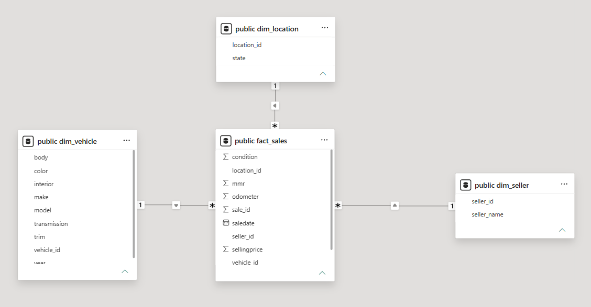
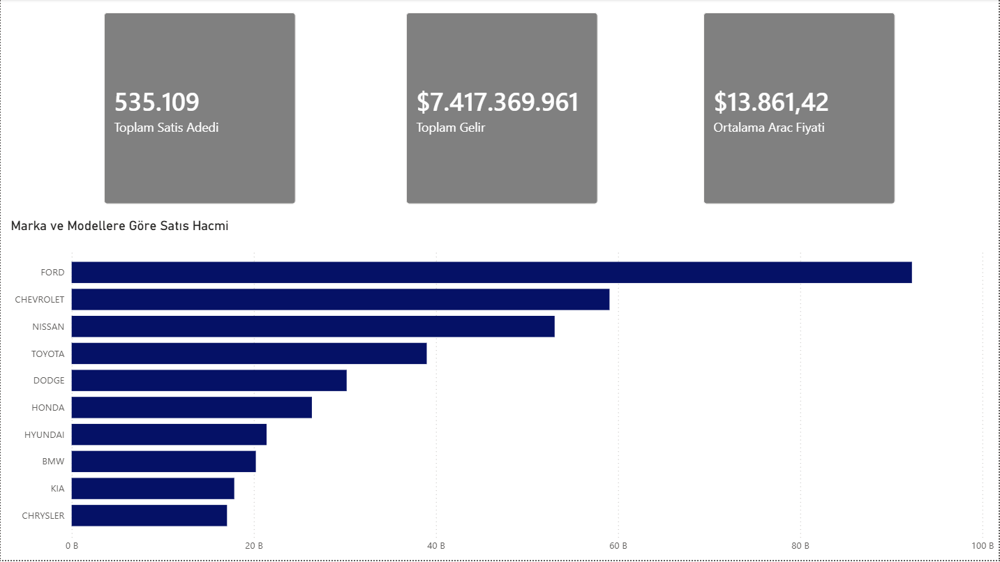

# 🚗 Car Sales Data Analytics & BI Dashboard

Driven by a strong passion for automotive dynamics and data science, this project transforms over 500,000 raw vehicle sales records into an interactive Business Intelligence dashboard. It aims to uncover market trends, pricing strategies, and top-performing models to support data-driven decision-making in the automotive sector.

### 📊 Dataset (Veriseti)
The raw vehicle sales dataset used in this project was obtained from Kaggle. 
🔗 **Data Source:** [Kaggle - Vehicle Sales Data](https://www.kaggle.com/datasets/syedanwarafridi/vehicle-sales-data)

---

### 📂 Project Architecture & Modular Structure
The project is built with a modular approach, reflecting enterprise-level engineering standards:

*   **`data_import_cleaning/`**: SQL scripts for cleaning, normalizing, and preparing raw sales data.
*   **`data_modelling/`**: Relational database design separating Fact and Dimension tables to establish a robust Star Schema architecture.
*   **`Power_BI/`**: The BI layer containing the `.pbix` file, DAX measures, and interactive visualizations.

### 📊 Visual Showcase

#### 1. Data Architecture (Star Schema)
The foundation of the analysis relies on a well-structured Star Schema connected via foreign keys, ensuring optimized query performance and accurate DAX calculations.

 

#### 2. Executive Dashboard (v1.0)
The front-end interface designed for management-level insights, featuring corporate KPIs and Top N model volume analysis.

### 🚧 Work in Progress 

---
---

# 🚗 Araç Satış Veri Analitiği ve İş Zekası (BI) Panosu

Otomotiv dinamiklerine ve veri bilimine olan güçlü ilgimden yola çıkarak tasarladığım bu proje, 500.000'den fazla ham araç satış kaydını etkileşimli bir İş Zekası panosuna dönüştürmektedir. Otomotiv sektöründe veri odaklı karar almayı desteklemek amacıyla pazar trendlerini, fiyatlandırma stratejilerini ve en çok satan modelleri ortaya çıkarmayı hedeflemektedir.

### 📂 Proje Mimarisi ve Modüler Yapı
Proje, kurumsal mühendislik standartlarını yansıtacak şekilde modüler bir yapıda inşa edilmiştir:

*   **`data_import_cleaning/`**: Ham satış verisini temizlemek, standartlaştırmak ve hazırlamak için kullanılan SQL betikleri.
*   **`data_modelling/`**: Sağlam bir Yıldız Şema (Star Schema) mimarisi kurmak için Fact ve Dimension tablolarını ayıran ilişkisel veritabanı tasarımı.
*   **`Power_BI/`**: `.pbix` dosyasını, DAX ölçülerini ve etkileşimli görselleştirmeleri içeren İş Zekası katmanı.

### 📊 Görsel Vitrin

#### 1. Veri Mimarisi (Yıldız Şema)
Analizin temeli, optimize edilmiş sorgu performansı ve doğru DAX hesaplamaları sağlayan, yabancı anahtarlarla (foreign key) bağlanmış iyi yapılandırılmış bir Yıldız Şema mimarisine dayanmaktadır.

 

#### 2. Yönetici Panosu (v1.0)
Kurumsal finansal KPI'ları ve İlk N (Top N) model hacim analizini içeren, yönetim seviyesinde içgörüler sunmak üzere tasarlanmış ön yüz arayüzü.

### 🚧 Geliştirme Aşamasında 
