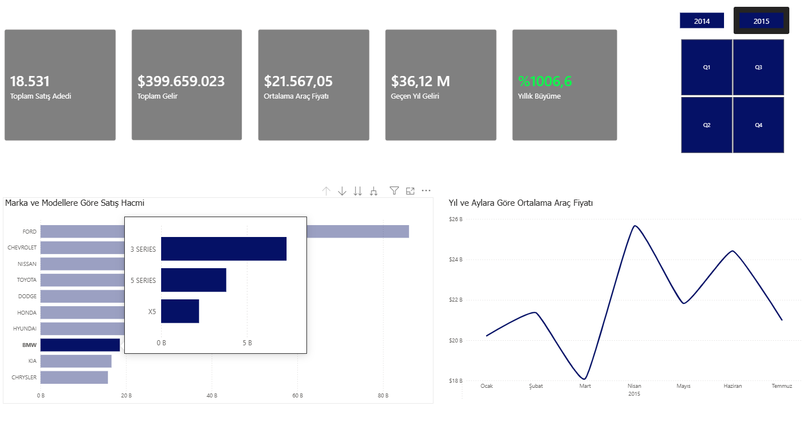
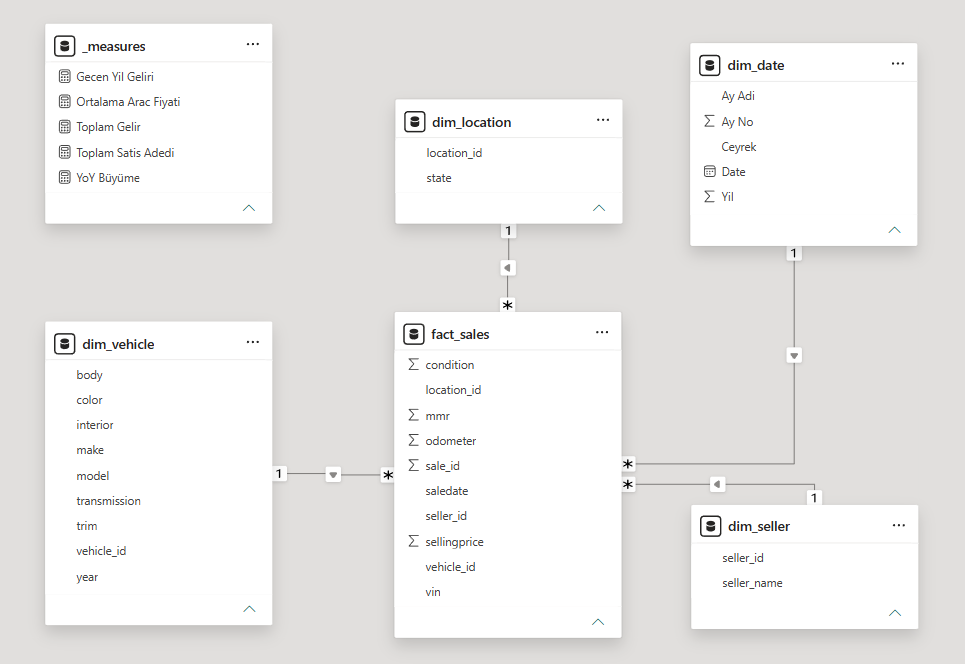

# 🚗 Vehicle Sales Data Analysis & BI Dashboard

Driven by a strong passion for automotive dynamics and data science, this project transforms over 500,000 raw vehicle sales records into an interactive Business Intelligence dashboard. It aims to uncover market trends, pricing strategies, and top-performing models to support data-driven decision-making in the automotive sector.

### 🚀 Advanced Business Intelligence (Dashboard_v3)
This final iteration elevates the dashboard from a standard visualization tool to an enterprise-grade BI solution:
* **Custom Hover Tooltips:** Engineered a dynamic, hidden report page that activates upon hovering over brand columns, instantly revealing the **Top 3** selling models for the selected brand.
* **Drill-Through Architecture:** Designed an 'Operations Room' page. Executives can right-click any brand on the main dashboard to drill down into a granular Matrix table (sales volume, revenue, and average price by body type) and a Donut Chart (transmission distribution).
* **Time Intelligence & YoY Growth (DAX):** Developed advanced DAX measures (`CALCULATE`, `SAMEPERIODLASTYEAR`, `DIVIDE`) to dynamically compute Year-over-Year (YoY) growth percentages.
* **Dynamic UI/UX & Conditional Formatting:** Added an interactive 'Year' slicer button and applied conditional formatting to the YoY Growth KPI card (dynamically turning Green for growth and Red for decline) for instant performance tracking.

### 📊 Dataset (Veriseti)
The raw vehicle sales dataset used in this project was obtained from Kaggle. 
🔗 **Data Source:** [Kaggle - Vehicle Sales Data](https://www.kaggle.com/datasets/syedanwarafridi/vehicle-sales-data)

---

### 📂 Project Architecture & Modular Structure
The project is built with a modular approach, reflecting enterprise-level engineering standards:

*   **`data_import_cleaning/`**: SQL scripts for cleaning, normalizing, and preparing raw sales data.
*   **`data_modelling/`**: Relational database design separating Fact and Dimension tables to establish a robust Star Schema architecture.
*   **`Power_BI/`**: The BI layer containing the `.pbix` file, DAX measures, and interactive visualizations.

#### Data Architecture (Star Schema)
The foundation of the analysis relies on a well-structured Star Schema connected via foreign keys, ensuring optimized query performance and accurate DAX calculations.

 

---
---

# 🚗 Araç Satış Veri Analizi ve İş Zekası (BI) Panosu

Otomotiv dinamiklerine ve veri bilimine olan güçlü ilgimden yola çıkarak tasarladığım bu proje, 500.000'den fazla ham araç satış kaydını etkileşimli bir İş Zekası panosuna dönüştürmektedir. Otomotiv sektöründe veri odaklı karar almayı desteklemek amacıyla pazar trendlerini, fiyatlandırma stratejilerini ve en çok satan modelleri ortaya çıkarmayı hedeflemektedir.

### 🚀 İleri Seviye İş Zekası (Dashboard_v3)
Bu son iterasyon, dashboard'u standart bir görselleştirme aracından kurumsal düzeyde bir İş Zekası (BI) çözümüne yükseltmektedir:
* **Özel Tasarım Bilgi Kartları (Custom Tooltips):** Marka sütunlarının üzerine gelindiğinde tetiklenen, seçili markanın en çok satan **ilk 3** modelini anında gösteren dinamik ve gizli bir rapor sayfası inşa edildi.
* **Detaylandırma Mimarisi (Drill-Through):** Yöneticilerin ana ekrandaki bir markaya sağ tıklayarak spesifik operasyonel detaylara inebileceği bir 'Operasyon Odası' tasarlandı. Bu sayfa, kasa tiplerine göre kırılımlı Finansal Matris (satış hacmi, ciro, ortalama fiyat) ve vites türü dağılımını (Halka Grafik) içermektedir.
* **Zaman Zekası ve YoY Büyüme (DAX):** Yıllık büyüme oranlarını (YoY) dinamik olarak hesaplamak için ileri seviye DAX formülleri (`CALCULATE`, `SAMEPERIODLASTYEAR`, `DIVIDE`) geliştirildi.
* **Dinamik UI/UX ve Koşullu Biçimlendirme (Conditional Formatting):** Arayüze interaktif 'Yıl' dilimleyici butonları eklendi. YoY Büyüme KPI kartına anlık performans takibi için veri odaklı koşullu biçimlendirme uygulandı (Büyüme için Yeşil, Düşüş/Zarar için Kırmızı).

### 📂 Proje Mimarisi ve Modüler Yapı
Proje, kurumsal mühendislik standartlarını yansıtacak şekilde modüler bir yapıda inşa edilmiştir:

*   **`data_import_cleaning/`**: Ham satış verisini temizlemek, standartlaştırmak ve hazırlamak için kullanılan SQL betikleri.
*   **`data_modelling/`**: Sağlam bir Yıldız Şema (Star Schema) mimarisi kurmak için Fact ve Dimension tablolarını ayıran ilişkisel veritabanı tasarımı.
*   **`Power_BI/`**: `.pbix` dosyasını, DAX ölçülerini ve etkileşimli görselleştirmeleri içeren İş Zekası katmanı.

#### Veri Mimarisi (Star Schema)
Analizin temeli, optimize edilmiş sorgu performansı ve doğru DAX hesaplamaları sağlamak için foreign key'ler ile birbirine bağlanan iyi yapılandırılmış bir Yıldız Şema'ya dayanmaktadır.

 

